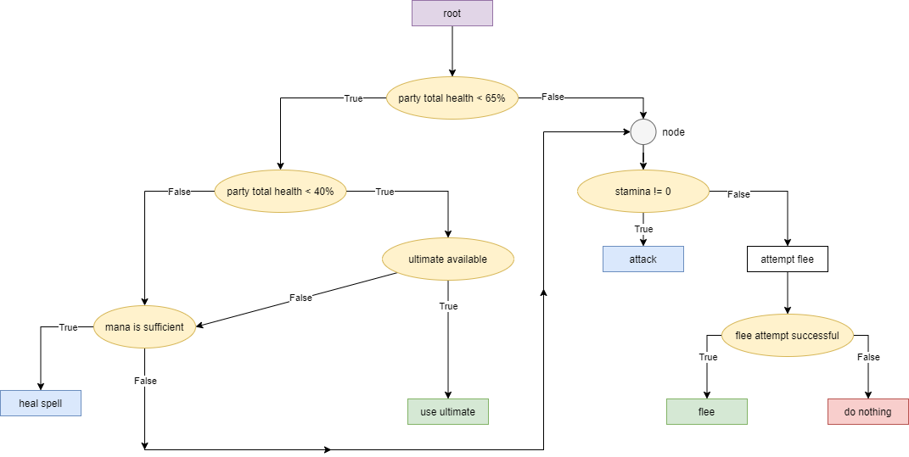

# CSAPX: Fall 2020

## Lab-4: (HeroStorm: RPG Game)
An RPG game with various character classes and abilities, built around an extensible system with scene rendering, basic AI based on behavior trees, terminal color using ANSI escape sequences, etc.

### Title Screen:

### Character-Select:

### Controllers:

### Battles:

##Some Behavior Trees:
 
 
